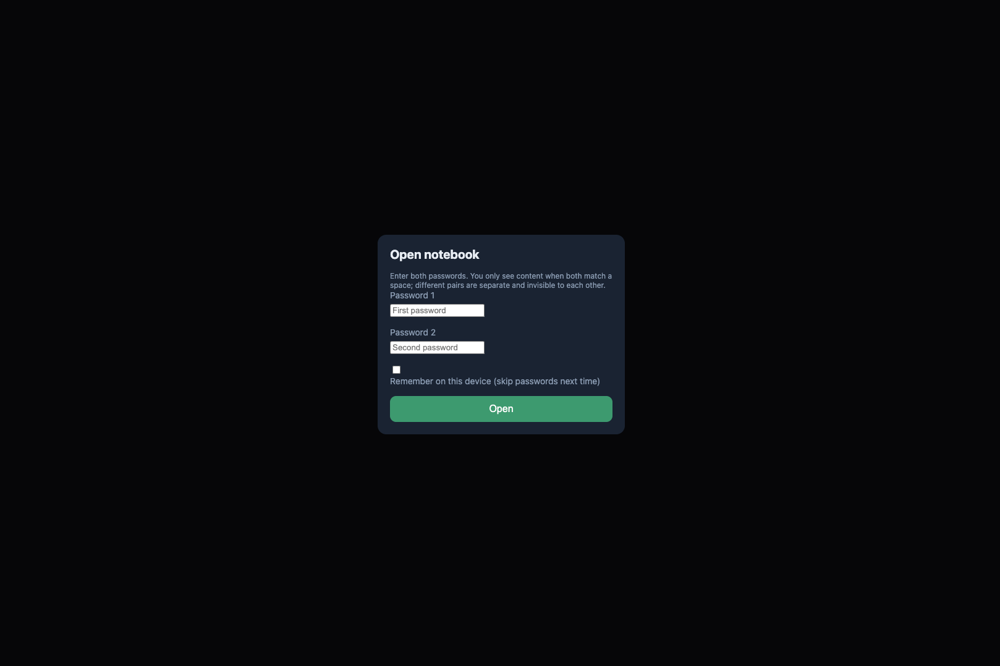
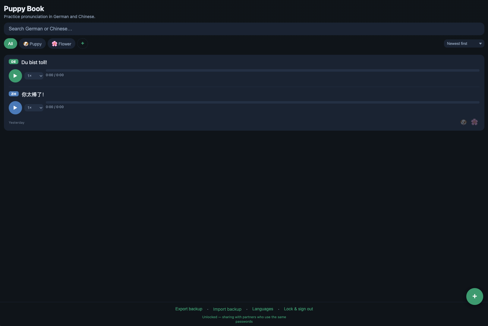
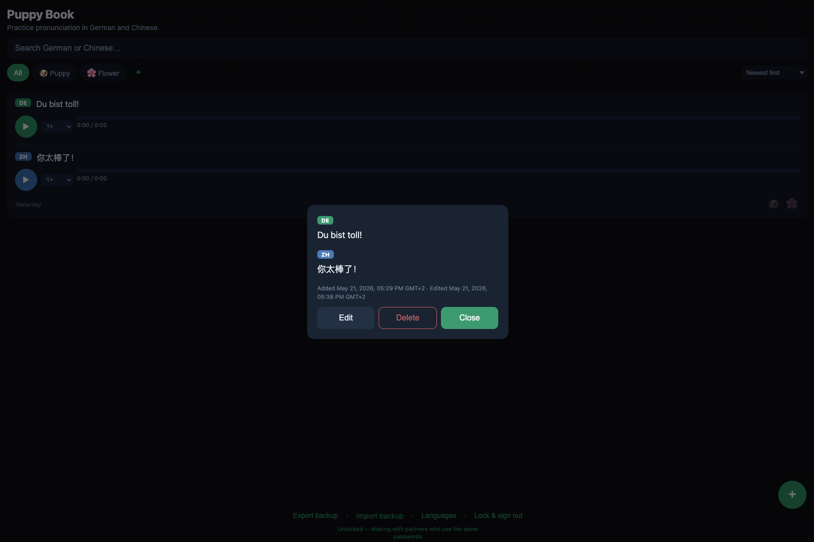
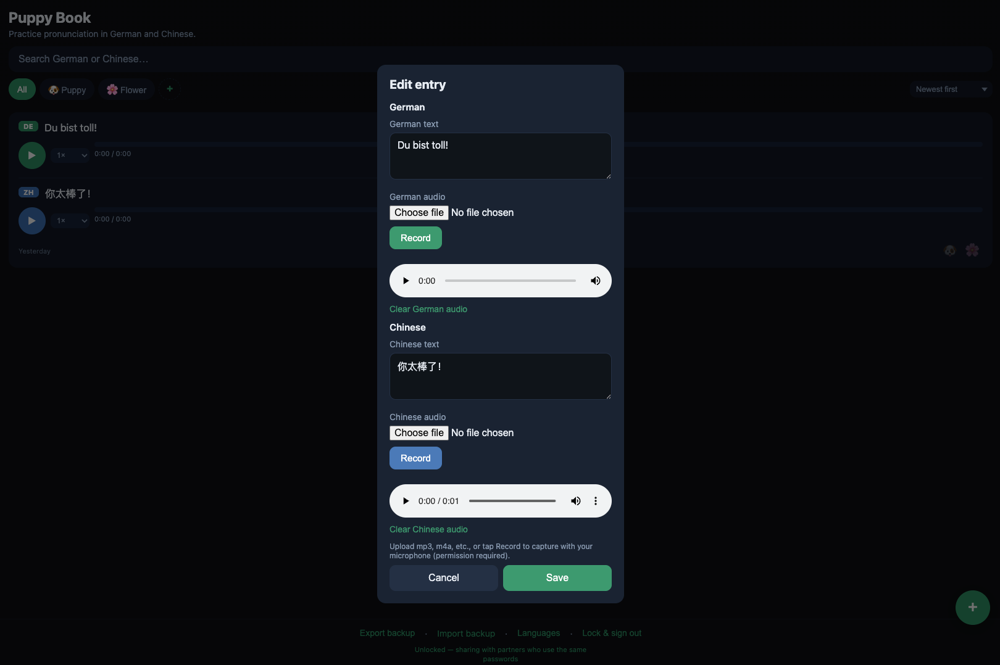
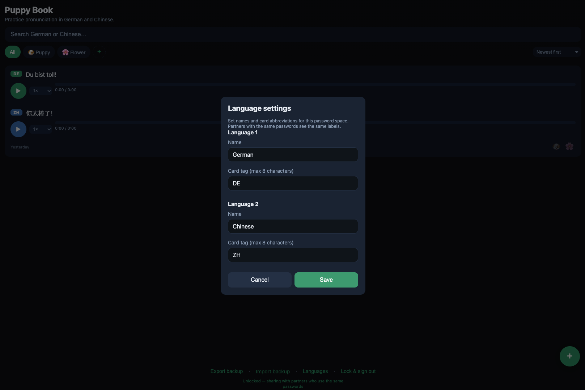

# Screenshots for README

Put interface images here, then commit them with the rest of the repo. GitHub renders paths like `docs/screenshots/login.png` from the repository root.

## Gallery

| File | Screen | What to capture |
| ---- | ------ | ----------------- |
| `login.png` | Unlock | **Open notebook** dialog (Password 1 & 2) |
| `main_page.png` | Main page | Entry list with at least one card (play buttons visible) |
| `card.png` | Card detail | Entry detail (read, Edit / Delete / Close) |
| `card_edit.png` | Card edit | **Edit entry** dialog (both languages + Record) |
| `language.png` | Languages | **Languages** settings dialog |

<p align="center">
  
  
  
  
  
</p>

Five screens only — no collection screenshots.

## How to capture

1. Run the app locally: `python3 -m http.server 8080` → open http://localhost:8080  
   Or use https://puppynote.netlify.app/
2. Use the same theme/size you want readers to see (phone: Safari screenshot; desktop: crop browser window ~390×844 or ~1200×800).
3. Export as **PNG** or **WebP** (WebP is smaller; GitHub supports both).
4. Save into this folder with the names above (or update paths in the root `README.md`).
5. `git add docs/screenshots/*.png` and push.

## Tips

- **Width:** README uses `width="320"` or `width="48%"` — source images ~750–1200 px wide are enough.
- **Privacy:** Blur or use demo passwords; avoid real partner phrases if the repo is public.
- **Alt text:** The root README sets `alt="..."` for accessibility; keep it short and descriptive.
- **Broken images:** If a file is missing, GitHub shows a broken icon until you add the file.

## Markdown reference (in README.md)

```markdown

```

Relative paths work on GitHub, GitLab, and most Markdown viewers when viewing the repo.
